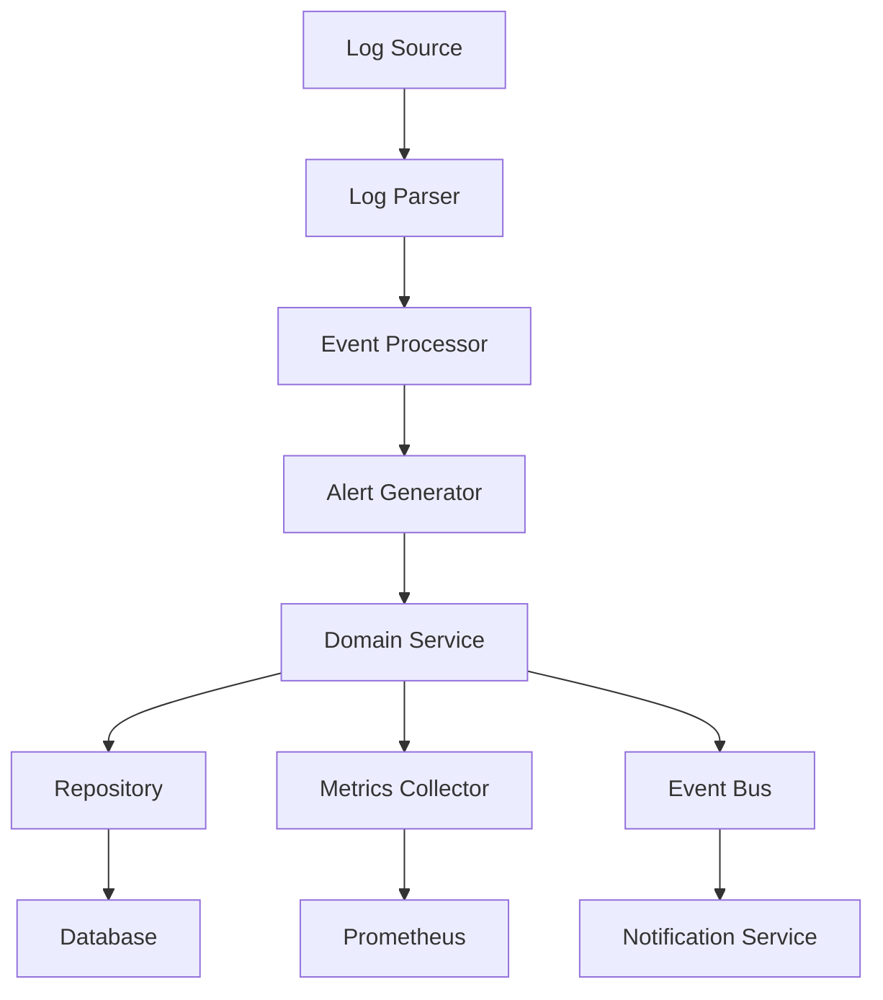
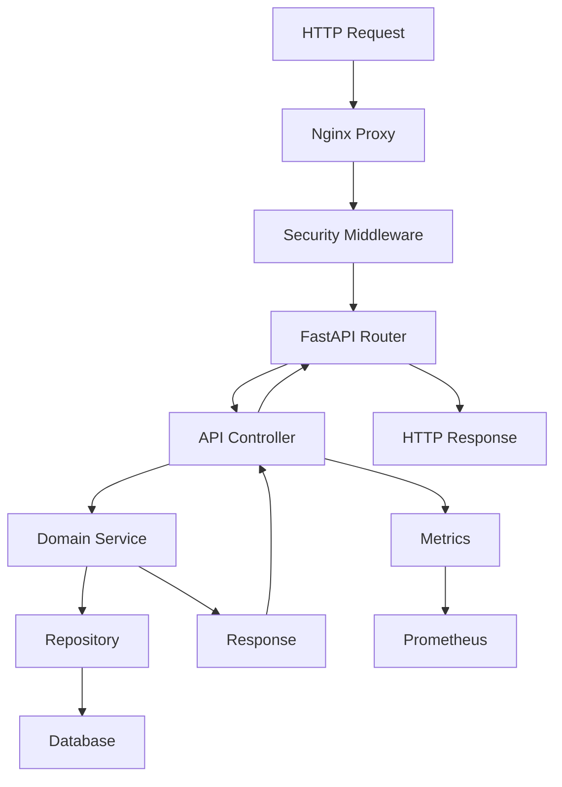

# SIEM Lite - Arquitectura del Sistema

## 🏗️ Descripción General

SIEM Lite es un sistema de gestión de información y eventos de seguridad construido con una arquitectura moderna, escalable y modular. Utiliza principios de Clean Architecture y Domain-Driven Design (DDD).

## 📊 Diagrama de Arquitectura

```
┌─────────────────────────────────────────────────────────────────────────────┐
│                              SIEM Lite Architecture                         │
└─────────────────────────────────────────────────────────────────────────────┘

┌─────────────────┐    ┌─────────────────┐    ┌─────────────────┐
│   Load Balancer │    │   Reverse Proxy │    │   SSL/TLS       │
│   (Nginx)       │────│   (Nginx)       │────│   Termination   │
│   Port 80/443   │    │   Rate Limiting │    │                 │
└─────────────────┘    └─────────────────┘    └─────────────────┘
         │                       │                       │
         └───────────────────────┼───────────────────────┘
                                 │
                    ┌─────────────────┐
                    │   SIEM Lite     │
                    │   FastAPI App   │
                    │   Port 8000     │
                    └─────────────────┘
                             │
        ┌────────────────────┼────────────────────┐
        │                    │                    │
┌─────────────────┐ ┌─────────────────┐ ┌─────────────────┐
│   PostgreSQL    │ │   Redis Cache   │ │   File Storage  │
│   Database      │ │   Session Store │ │   Logs & Reports│
│   Port 5432     │ │   Port 6379     │ │                 │
└─────────────────┘ └─────────────────┘ └─────────────────┘

┌───────────────────────────────────────────────────────────────────────────┐
│                            Monitoring Stack                               │
├─────────────────┬─────────────────┬─────────────────┬─────────────────────┤
│   Prometheus    │   Grafana       │   Alertmanager  │   Jaeger (Tracing)  │
│   Metrics       │   Dashboards    │   Notifications │   Distributed       │
│   Port 9090     │   Port 3000     │   Port 9093     │   Tracing           │
└─────────────────┴─────────────────┴─────────────────┴─────────────────────┘
```

## 🎯 Arquitectura Hexagonal (Clean Architecture)

### Capas de la Aplicación

```
┌──────────────────────────────────────────────────────────────┐
│                        Presentation Layer                    │
│  ┌─────────────┐  ┌─────────────┐  ┌─────────────┐           │
│  │   FastAPI   │  │   CLI       │  │   WebUI     │           │
│  │   REST API  │  │   Commands  │  │   Dashboard │           │
│  └─────────────┘  └─────────────┘  └─────────────┘           │
└──────────────────────────────────────────────────────────────┘
                                │
┌──────────────────────────────────────────────────────────────┐
│                       Application Layer                      │
│  ┌─────────────┐  ┌─────────────┐  ┌─────────────┐           │
│  │   Use Cases │  │   Services  │  │   DTOs      │           │
│  │   Business  │  │   Workflows │  │   Schemas   │           │
│  │   Logic     │  │             │  │             │           │
│  └─────────────┘  └─────────────┘  └─────────────┘           │
└──────────────────────────────────────────────────────────────┘
                                │
┌──────────────────────────────────────────────────────────────┐
│                         Domain Layer                         │
│  ┌─────────────┐  ┌─────────────┐  ┌─────────────┐           │
│  │   Entities  │  │   Value     │  │   Domain    │           │
│  │   (Alert,   │  │   Objects   │  │   Services  │           │
│  │    User)    │  │             │  │             │           │
│  └─────────────┘  └─────────────┘  └─────────────┘           │
└──────────────────────────────────────────────────────────────┘
                                │
┌──────────────────────────────────────────────────────────────┐
│                      Infrastructure Layer                    │
│  ┌─────────────┐  ┌─────────────┐  ┌─────────────┐           │
│  │   Database  │  │   External  │  │   File      │           │
│  │   (SQLAlch) │  │   APIs      │  │   System    │           │
│  │             │  │             │  │             │           │
│  └─────────────┘  └─────────────┘  └─────────────┘           │
└──────────────────────────────────────────────────────────────┘
```

## 📁 Estructura de Directorios

```
siem-lite/
├── siem_lite/                    # Aplicación principal
│   ├── __init__.py
│   ├── main.py                   # Punto de entrada FastAPI
│   ├── cli.py                    # Interfaz de línea de comandos
│   ├── cli_dashboard.py          # Dashboard en CLI
│   │
│   ├── api/                      # Capa de Presentación - API REST
│   │   ├── __init__.py
│   │   ├── alerts.py             # Endpoints de alertas
│   │   ├── health.py             # Health checks
│   │   ├── metrics.py            # Métricas Prometheus
│   │   ├── root.py               # Endpoint raíz
│   │   ├── schemas.py            # Esquemas Pydantic
│   │   └── stats.py              # Estadísticas
│   │
│   ├── domain/                   # Capa de Dominio - Lógica de negocio
│   │   ├── __init__.py
│   │   ├── entities.py           # Entidades del dominio
│   │   ├── interfaces.py         # Interfaces/Contratos
│   │   ├── services.py           # Servicios del dominio
│   │   ├── rules.py              # Reglas de negocio
│   │   └── features.py           # Características del dominio
│   │
│   ├── infrastructure/           # Capa de Infraestructura
│   │   ├── __init__.py
│   │   ├── database.py           # Configuración BD
│   │   ├── models.py             # Modelos ORM
│   │   ├── repositories.py       # Implementación repositorios
│   │   ├── parsers.py            # Analizadores de logs
│   │   ├── processor.py          # Procesador de eventos
│   │   ├── log_generator.py      # Generador de logs
│   │   └── report_generator.py   # Generador de reportes
│   │
│   ├── utils/                    # Utilidades transversales
│   │   ├── __init__.py
│   │   ├── config.py             # Configuración
│   │   ├── exceptions.py         # Excepciones personalizadas
│   │   ├── logging.py            # Sistema de logging
│   │   ├── metrics.py            # Colector de métricas
│   │   ├── security.py           # Middleware de seguridad
│   │   └── validation.py         # Validaciones
│   │
│   └── data/                     # Datos y recursos
│       └── simulated.log         # Logs de ejemplo
│
├── tests/                        # Tests
│   ├── conftest.py              # Configuración pytest
│   ├── test_api.py              # Tests de API
│   └── test_domain.py           # Tests de dominio
│
├── docs/                         # Documentación
│   ├── API.md                   # Documentación de API
│   ├── MONITORING.md            # Métricas y monitoreo
│   └── ARCHITECTURE.md          # Este archivo
│
├── monitoring/                   # Stack de monitoreo
│   ├── prometheus/              # Configuración Prometheus
│   │   ├── prometheus.yml
│   │   └── rules/
│   └── grafana/                 # Dashboards Grafana
│       ├── dashboards/
│       └── datasources/
│
├── nginx/                        # Configuración Nginx
│   └── nginx.conf
│
├── scripts/                      # Scripts de deployment
│   ├── deploy.sh
│   ├── setup.sh
│   └── start.sh
│
├── .github/                      # CI/CD GitHub Actions
│   └── workflows/
│       ├── ci-cd.yml
│       └── security.yml
│
├── docker-compose.yml            # Orquestación de contenedores
├── Dockerfile                    # Imagen de la aplicación
├── requirements.txt              # Dependencias Python
├── pyproject.toml               # Configuración del proyecto
└── README.md                    # Documentación principal
```

## 🔄 Flujo de Datos

### 1. Ingesta de Alertas



### 2. Procesamiento de Requests API



## 🧩 Componentes Principales

### 1. API Layer (Presentación)

**Responsabilidades:**
- Manejo de requests HTTP
- Validación de entrada
- Serialización de respuestas
- Autenticación y autorización
- Rate limiting

**Tecnologías:**
- FastAPI
- Pydantic (validación)
- JWT (autenticación)
- CORS middleware

### 2. Domain Layer (Dominio)

**Responsabilidades:**
- Lógica de negocio pura
- Entidades del dominio
- Reglas de negocio
- Interfaces/contratos

**Componentes:**
- `Alert`: Entidad principal
- `User`: Gestión de usuarios
- `AlertService`: Lógica de alertas
- `IAlertRepository`: Interface del repositorio

### 3. Infrastructure Layer (Infraestructura)

**Responsabilidades:**
- Persistencia de datos
- Servicios externos
- Sistemas de archivos
- Caching

**Tecnologías:**
- SQLAlchemy (ORM)
- PostgreSQL/SQLite
- Redis (cache)
- File system

### 4. Utils (Utilidades)

**Responsabilidades:**
- Configuración
- Logging
- Métricas
- Seguridad
- Validaciones

## 🔧 Patrones de Diseño Implementados

### 1. Repository Pattern
```python
class IAlertRepository(ABC):
    @abstractmethod
    def get_all_alerts(self) -> List[Alert]:
        pass
    
    @abstractmethod
    def create_alert(self, alert: Alert) -> Alert:
        pass

class SQLAlchemyAlertRepository(IAlertRepository):
    def get_all_alerts(self) -> List[Alert]:
        # Implementación específica
        pass
```

### 2. Dependency Injection
```python
def get_alert_service(db: Session = Depends(get_db)) -> AlertService:
    repo = SQLAlchemyAlertRepository(db)
    return AlertService(repo)

@router.post("/alerts")
async def create_alert(
    alert_data: AlertCreate,
    service: AlertService = Depends(get_alert_service)
):
    return await service.create_alert(alert_data)
```

### 3. Factory Pattern
```python
class MetricsCollectorFactory:
    @staticmethod
    def create(config: Config) -> MetricsCollector:
        if config.enable_metrics:
            return PrometheusMetricsCollector()
        return NoOpMetricsCollector()
```

### 4. Observer Pattern
```python
class AlertEventBus:
    def __init__(self):
        self._observers = []
    
    def subscribe(self, observer):
        self._observers.append(observer)
    
    def notify(self, event):
        for observer in self._observers:
            observer.handle(event)
```

## 🚀 Escalabilidad y Performance

### Estrategias de Escalabilidad

#### 1. Horizontal Scaling
- Load balancer (Nginx)
- Múltiples instancias de la aplicación
- Database read replicas
- Redis cluster

#### 2. Caching Strategy
```python
# Cache en memoria para queries frecuentes
@lru_cache(maxsize=1000)
def get_alert_statistics():
    # Cálculo costoso de estadísticas
    pass

# Cache distribuido con Redis
def get_cached_alerts(cache_key: str):
    if cached := redis.get(cache_key):
        return json.loads(cached)
    
    alerts = fetch_from_database()
    redis.setex(cache_key, 300, json.dumps(alerts))
    return alerts
```

#### 3. Database Optimization
- Índices optimizados
- Particionamiento de tablas
- Connection pooling
- Query optimization

### Performance Monitoring

#### Métricas Clave
- **Latency**: P50, P95, P99 de response time
- **Throughput**: Requests por segundo
- **Error Rate**: Porcentaje de errores
- **Availability**: Uptime del sistema

#### SLAs Definidos
- **API Response Time**: P95 < 500ms
- **Availability**: 99.9% uptime
- **Alert Processing**: < 1 segundo
- **Data Retention**: 1 año de alertas

## 🔒 Seguridad

### Capas de Seguridad

#### 1. Network Level
- Firewall rules
- VPN access
- SSL/TLS encryption
- DDoS protection

#### 2. Application Level
```python
# Rate limiting
@limiter.limit("100/minute")
async def api_endpoint():
    pass

# Input validation
class AlertCreate(BaseModel):
    source_ip: IPv4Address
    alert_type: str = Field(..., max_length=100)
    
    @validator('source_ip')
    def validate_ip(cls, v):
        # Validación personalizada
        return v
```

#### 3. Data Level
- Encryption at rest
- Sensitive data masking
- Audit logs
- Data retention policies

### Security Headers
```python
# Headers de seguridad automáticos
response.headers.update({
    "X-Content-Type-Options": "nosniff",
    "X-Frame-Options": "DENY",
    "X-XSS-Protection": "1; mode=block",
    "Strict-Transport-Security": "max-age=31536000; includeSubDomains"
})
```

## 📊 Monitoreo y Observabilidad

### Métricas (Prometheus)
- Business metrics (alertas creadas, resueltas)
- Technical metrics (response time, error rate)
- Infrastructure metrics (CPU, memoria, disco)

### Logging (Structured)
```python
logger.info(
    "Alert created",
    alert_id=alert.id,
    source_ip=alert.source_ip,
    severity=alert.severity,
    user_id=current_user.id
)
```

### Tracing (Jaeger)
- Request tracing end-to-end
- Performance bottleneck identification
- Error propagation tracking

### Dashboards (Grafana)
- Operations dashboard
- Business metrics dashboard
- SLA monitoring dashboard

## 🔄 CI/CD Pipeline

### Stages
1. **Test**: Unit tests, integration tests
2. **Security**: SAST, dependency scanning
3. **Build**: Docker image creation
4. **Deploy**: Rolling deployment
5. **Monitor**: Health checks, smoke tests

### Quality Gates
- Test coverage > 80%
- No critical security vulnerabilities
- Performance regression tests pass
- Manual approval for production

## 🛠️ Tecnologías Utilizadas

### Backend
- **Python 3.8+**: Lenguaje principal
- **FastAPI**: Framework web
- **SQLAlchemy**: ORM
- **Pydantic**: Validación de datos
- **Pytest**: Testing framework

### Database
- **PostgreSQL**: Base de datos principal
- **SQLite**: Desarrollo y testing
- **Redis**: Cache y sesiones

### Monitoring
- **Prometheus**: Métricas
- **Grafana**: Dashboards
- **Alertmanager**: Notificaciones

### Infrastructure
- **Docker**: Containerización
- **Nginx**: Reverse proxy
- **GitHub Actions**: CI/CD

## 📋 Consideraciones de Diseño

### Principios Aplicados
1. **Separation of Concerns**: Cada capa tiene responsabilidades específicas
2. **Dependency Inversion**: Dependencies apuntan hacia abstracciones
3. **Single Responsibility**: Cada clase/módulo tiene una responsabilidad
4. **Open/Closed**: Abierto para extensión, cerrado para modificación

### Trade-offs
- **Complejidad vs Flexibilidad**: Arquitectura más compleja pero más mantenible
- **Performance vs Consistencia**: Eventual consistency para mejor performance
- **Security vs Usability**: Múltiples capas de seguridad con UX balanceada

## 🔮 Roadmap Futuro

### Próximas Funcionalidades
1. **Machine Learning**: Detección de anomalías
2. **Real-time Processing**: Stream processing con Kafka
3. **Multi-tenancy**: Soporte para múltiples organizaciones
4. **Advanced Analytics**: ML models para predicción

### Mejoras Técnicas
1. **Microservices**: Separación en microservicios
2. **Event Sourcing**: Historial completo de eventos
3. **CQRS**: Separación de read/write models
4. **GraphQL**: API más flexible
